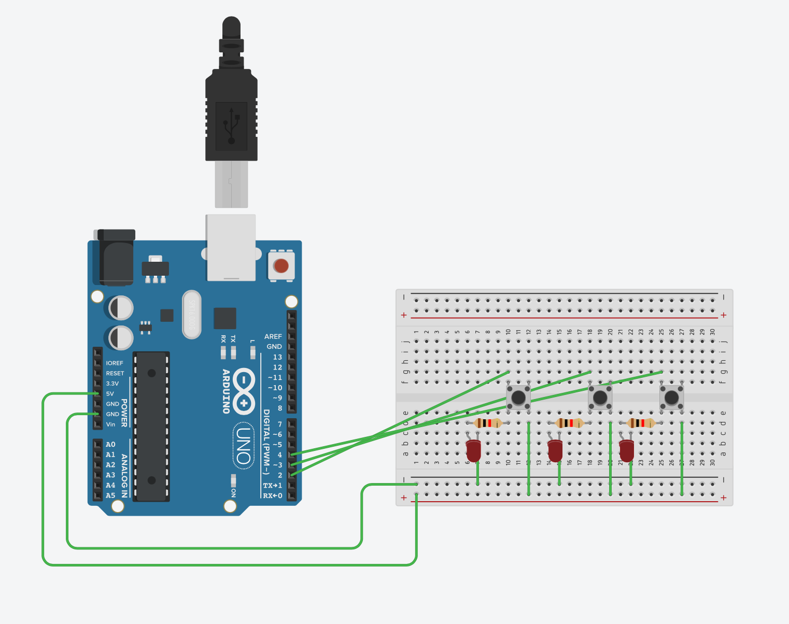

```.C
// 
//variables for the LEDs
int pin2 = 2;
int pin3 = 3;
int pin4 = 4;
//variables for the buttons
int button2 = 2;
int button3 = 3;
int button4 = 4;
//variables for state of button
int buttonState2 = 0;
int buttonState3 = 0;
int buttonState4 = 0;

void setup()
{
pinMode(button2, INPUT);
pinMode(pin2, OUTPUT);
}

void loop()
{ 
//check if button is pushed or not
buttonState2 = digitalRead(button2);
if (buttonState2 == HIGH)
{
digitalWrite(pin2, HIGH);
} 
else{
digitalWrite(pin2, LOW);
}

buttonState3 = digitalRead(button3);
if (buttonState3 == HIGH)
{
digitalWrite(pin3, HIGH);
} 
else{
digitalWrite(pin3, LOW);
}

buttonState4 = digitalRead(button4);
if (buttonState4 == HIGH)
{
digitalWrite(pin4, HIGH);
} 
else{
digitalWrite(pin4, LOW);
}

}
```
