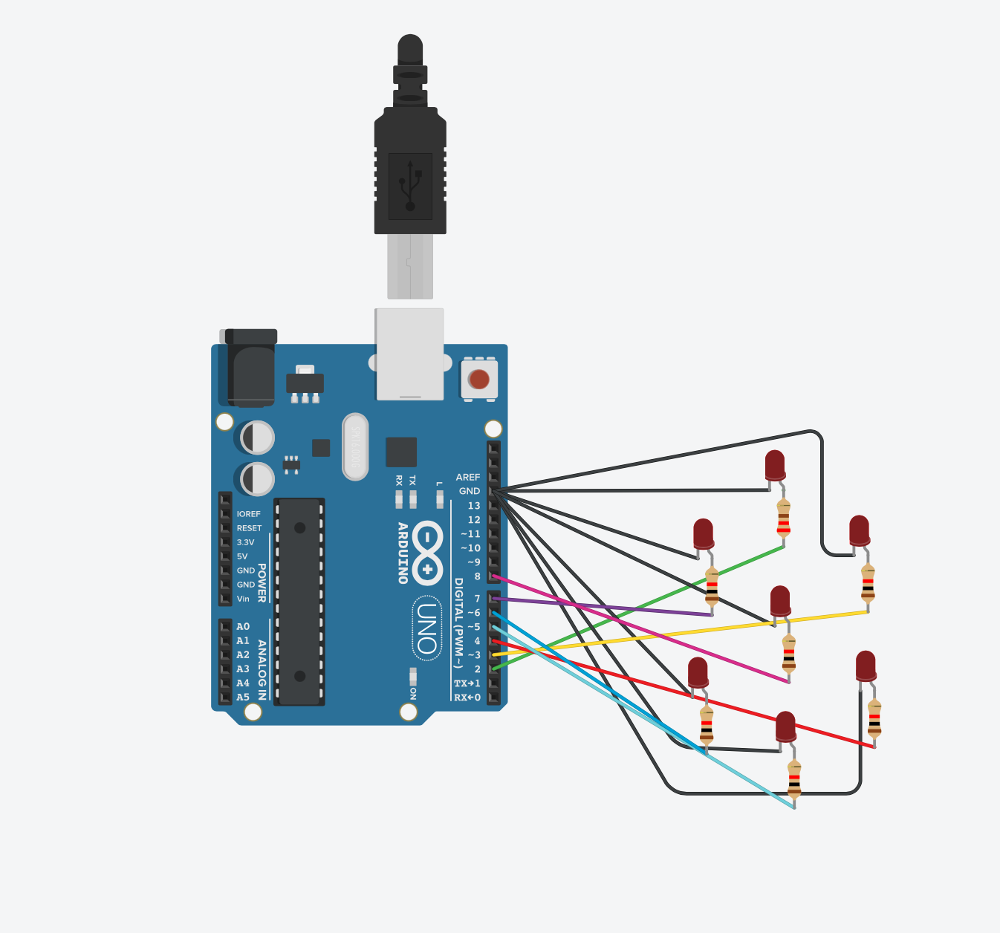

```.C
// variables for lights
int portA = 2;
int portB = 3;
int portC = 4;
int portD = 5;
int portE = 6;
int portF = 7;
int portG = 8;

void setup()
{
  // setting up the lights
  pinMode(portA, OUTPUT);
  pinMode(portB, OUTPUT);
  pinMode(portC, OUTPUT);
  pinMode(portD, OUTPUT);
  pinMode(portE, OUTPUT);
  pinMode(portF, OUTPUT);
  pinMode(portG, OUTPUT);
}

void loop()
{
  // defining inputs
  bool X = false;
  bool Y = false;
  bool Z = false;
  bool W = true;
  // From the slide the equation is A = notX W + YZ + YnotWnotZ + XnotWZ + WnotZnotY +   notXnotYnotZ
  // not = !, and = &&, or = ||
  int A = (!X && W) || (Y && Z) || (Y && !W && !Z) || (W && !Z && !Y) || (!X && !Y && !Z);
  digitalWrite(portA, HIGH);
  // notY notZ + notZ y notX+ Z  notY notX + notW  Y  X+ W notY  X
  int B = (!Y && !Z) || (!Z && Y & !X) || (Z && !Y && !X) || (!W && Y && X) || (W && !Y && X);
  digitalWrite(portB, HIGH);
  // NotY Not Z + NotY NotX Z  + NotY X Z + Y W NotZ + Y NotW Z + YX NotW
  int C = (!Y && !Z) || (!Y && !X && Z) || (!Y && X && Z) || (Y && W && !Z) || (Y && !W && Z) || (Y && X && !W);
  digitalWrite(portC, HIGH);
  // notW notZ notX  +  notY not X W + Y notX Z + Y X notZ + notY X Z
  int D = (!W && !Z && !X) || (!Y && !X && W) || (Y && !X && Z) || (Y&& X && !Z) || (!Y && X && Z);
  digitalWrite(portD, HIGH);
  // notZnotYnotX+WnotY+WnotYnotX+WZntoX+notYX+XWnotZ+notWnotZnotY
  int E = (!Z && !Y&&!X) || (W&&!Y) || (W&&!Y&&!X) || (W&&Z&&!X) || (!Y&&X) ||(X&&W&&!Z) ||(!W&&!Z&&!Y);
  digitalWrite(portE, HIGH);
  // YZ + ZnotWnotX + notXnotYnotZ + WnotZnotY + ZnotWnotY
  int F = (Y&&Z) || (Z&&!W&&!X) || (!X&&!Y&&!Z) || (W&&!Z&&!Y) || (Z&&!W&&!Y);
  digitalWrite(portF, HIGH);
  //WY + WnotZnotX + notWZnotX + WnotZX + ZnotYX + notWnotZY
  int G = (W&&Y) || (W&&!Z&&!X) || (!W&&Z&&!X) || (W&&!Z&&X) || (Z&&!Y&&X) || (!W&&!Z&&Y);
  digitalWrite(portG, HIGH);
}
```
