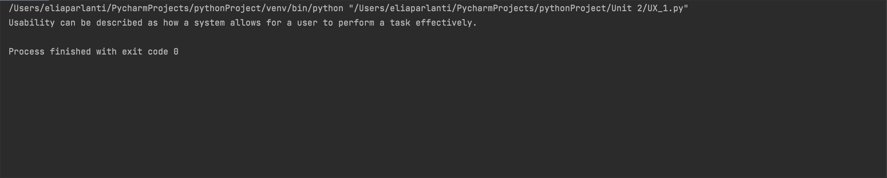

```.py
def UX_terms(word):
    if word == "usability":
        answer="Usability can be described as how a system allows for a user to perform a task effectively."
    if word == "usefulness":
        answer="Usefulness describes anything that helps you get closer to or meet your goals."
    if word == "desirability":
        answer="desirability refers to what compels users to actually want to use the product."
    return answer
output = UX_terms("usability")
print(output)
```

